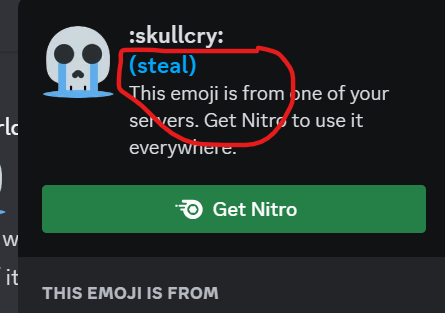

# nitro-emoji

## info
> minimal extension to send custom emoji (not in-line)

* click "steal" to copy emoji url with with a predefined size
  

* saves emoji markdown using [chrome storage.sync](https://developer.chrome.com/docs/extensions/reference/storage/) 

* when emoji markdown is typed in the textbox, it is replaced with its img url if you've clicked "steal" for it before; for example, typing ``:skullcry:`` (see img above) would replace ur current input with a modified url, and visually replace the url with the image as well
* because discord doesn't support inline image embeds for users, you can only use one emoji per line, so send it in a separate text message 

## installation
* download [build-archive.zip](https://github.com/deontic/nitro-emoji/raw/main/build-archive/build-archive.zip) and **<ins>extract</ins> the build** folder present inside the archive (clicking this link downloads the zip file)
 
* visit chrome://extensions/ via the addressbar

       

* enable Developer Mode via the topbar

        
          
* select "Load unpacked"

        
* select the **build** folder you extracted in step 1
* plugin should be installed, refresh Chrome tabs where you need to use this

*Note: it is trivial to imitate this plugin's functionality yourself -- all this plugin does is provide some degree of automation* 🙂
